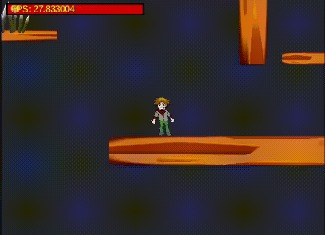
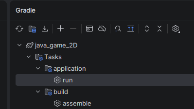

# JavaGame2D

## About 

This is a 2d platformer, built on top of LibGDX. It has extensive, modular features, such as:
- ECS for game object management, 
- custom rendering pipeline, 
- custom animation state machines
- custom entity serialization/deserialization

Above all, it's an all-purpose base for creating 2d platformers. It also comes with a playable demo

## How to run

### instlling pre-built version

### running from source via IntelliJ IDEA

Clone this repository, and open it in IntelliJ IDEA IDE
IntelliJ should autodetect gradle settings. Run the game with:

## Platforms

- `core`: Main module with the application logic shared by all platforms.
- `lwjgl3`: Primary desktop platform using LWJGL3; was called 'desktop' in older docs.

## Gradle

This project uses [Gradle](https://gradle.org/) to manage dependencies.
The Gradle wrapper was included, so you can run Gradle tasks using `gradlew.bat` or `./gradlew` commands.
Useful Gradle tasks and flags:

- `--continue`: when using this flag, errors will not stop the tasks from running.
- `--daemon`: thanks to this flag, Gradle daemon will be used to run chosen tasks.
- `--offline`: when using this flag, cached dependency archives will be used.
- `--refresh-dependencies`: this flag forces validation of all dependencies. Useful for snapshot versions.
- `build`: builds sources and archives of every project.
- `cleanEclipse`: removes Eclipse project data.
- `cleanIdea`: removes IntelliJ project data.
- `clean`: removes `build` folders, which store compiled classes and built archives.
- `eclipse`: generates Eclipse project data.
- `idea`: generates IntelliJ project data.
- `lwjgl3:jar`: builds application's runnable jar, which can be found at `lwjgl3/build/libs`.
- `lwjgl3:run`: starts the application.
- `test`: runs unit tests (if any).

Note that most tasks that are not specific to a single project can be run with `name:` prefix, where the `name` should be replaced with the ID of a specific project.
For example, `core:clean` removes `build` folder only from the `core` project.
